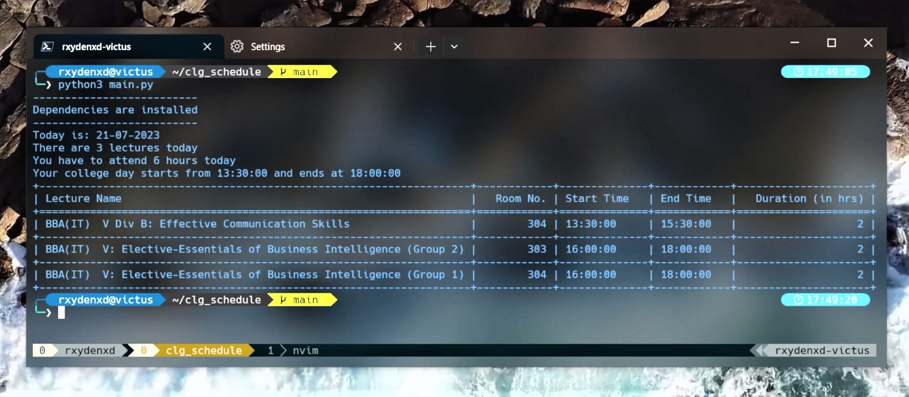
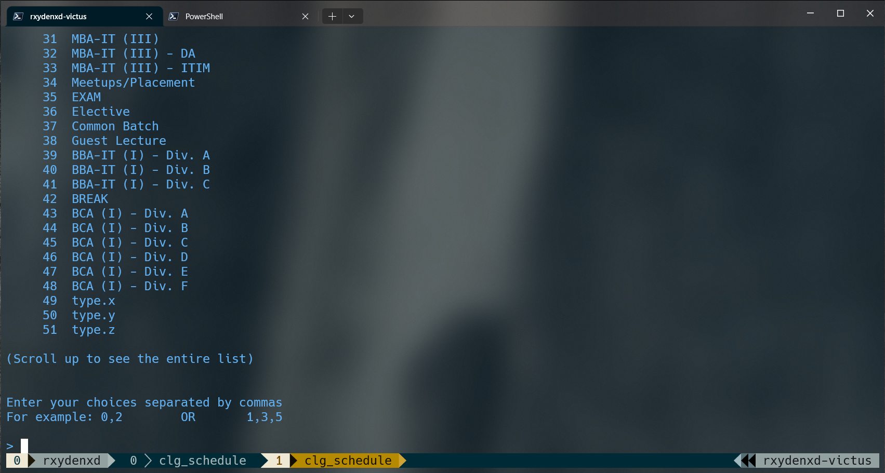

## 📢 Announcements

#### Major Changes

If you have downloaded this project on/before 26-07-23, Kindly download the latest .zip for this project.

---



🎒 <i> Keep track of your college schedule right from your terminal! </i> 💻

## Introduction

This Python-based project fetches up-to-date time-table schedules from SICSR time-table website (https://time-table.sicsr.ac.in) and displays them in a tabular format inside the terminal, eliminating the generic rigorous process of Going to the time-table website -> Choosing their Course/Division/Elective Group one-by-one -> Viewing all of their schedules one-by-one.

## Features

- **🔄 Automatic Module Installation**: To ensure a seamless user experience, my script automatically downloads the required modules during its execution, making it easy for anyone to set up and use.

- **📊 Tabulate Library for Tabular Display**: Once the data is captured, my script uses the 'tabulate' library to process and present it in a neat and organized tabular format, making it user-friendly and visually appealing.

- **🔄 Live Data**: This script utilizes Python's 'BeautifulSoup' library that fetches the latest list of Courses, Elective Lists, etc., from the Time-Table website to ensure the script works even if there are additions to Courses, Elective Lists, etc.

- **⚙ One-Time Configuration**: The user's Course/Elective Group choices are stored in a dot file in the project directory, eliminating the generic viewing process of the timetable.

- **🔄 Auto-Update**: To ensure that the user has the latest version of this script, I have implemented an auto-update feature which checks for any changes in this repository and automatically downloads new files and alters the existing ones.

## Requirements

- [Python](https://python.org/downloads)
- [pip](https://pypi.org/project/pip/)

#### Python Dependencies

##### `requests`

- You can install `requests` by using [pip](https://pypi.org/project/pip/):

  ```python
  pip install requests
  ```

##### `tabulate`

- You can install `tabulate` by using [pip](https://pypi.org/project/pip/):

  ```python
  pip install tabulate
  ```

##### `BeautifulSoup`

- You can install `bs4` by using [pip](https://pypi.org/project/pip/):

  ```python
  pip install bs4
  ```

> These dependencies are automatically installed on `main.py`'s first execution and is ensured by `.ensure_dependencies` in the project folder.

## Configuration

#### UPDATE

I have successfully eliminated the need to edit `requestURL.txt` by providing a feature that lets the user decide their Course, Elective Groups, etc. upon first execution.



> This configuration can be reset by deleting the `.config` file in the project directory.

## 📝 To-Do List

- [x] check and auto-install dependencies
- [x] Description for README.md
- [ ] mobile-version to work with siri (ios)
- [ ] Choosing any other date

---

> Developed by:

### Anirudh Meshram [](https://www.linkedin.com/in/anirudh-meshram/)

🎓 Symbiosis International (Deemed University)\
💼 Nestlé | Symbiosis Centre for International Education\
📄 [Resume / CV](https://docs.google.com/document/d/1DNtgwjOoLIUEXjDqhiM5x3OZc3uJmC9BC4-K7pix5dM/edit)
